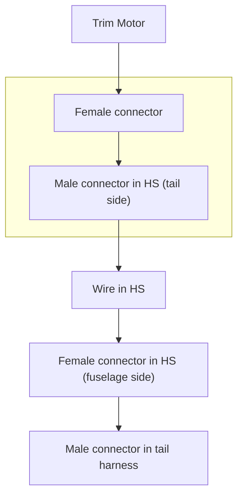

### TLDR

- Wired up connectors for trim motor

### Details

I added 2 Delphi connectors for the trim motor to connect to the tail harness.

The wiring inside the HS likely will need to be cut to length when I do the final assembly, so I'm not adding the connectors on the fuselage side just yet.

### Female connector on motor

I used the pre-wired connector from Midwest Panel. They have labeled the pin diagram so I just followed.

| PIN | Color  |
| --- | ------ |
| A   | White  |
| B   | Grey   |
| C   | Orange |
| D   | Green  |
| E   | Blue   |

### Male connector on HS

The wire going through HS needs to connect to the motor. It doesn't have the same color code as the motor though. So here is my pin sequence.

| PIN | Color  |
| --- | ------ |
| A   | White  |
| B   | Red    |
| C   | Orange |
| D   | Green  |
| E   | Blue   |

Basically, **red is grey**.

I need to remember this when connector the pins on the other side of the wire.

### Pictures for reference

