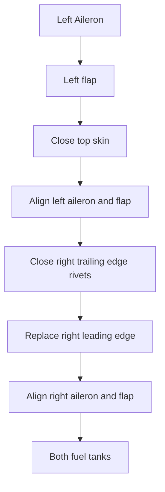

## Tasks completed

- Received fuselage kit
- Cleaned all parts for left aileron and flap
- Built left aileron
- Replace a M4 screw with striped head (on pitot control box)

## Fuselage kit

The timing couldn't have been better. I am just finishing up the wing kit as I got the call from the shipping company for fuselage delivery.

I still have a a lot to do on the wing, but there were few enough parts that I could just take them out and get rid of the crate to make space for the fuselage.

With help from my dad, we cleaned the wing crate and moved it out of the garage this Friday.

Later in the afternoon, the shipping truck arrived with my fuselage. The unloading process could have been better. **Sling if you are reading this blog, please consider redesign the crate. gap betweenb the 4x4 wooden leg on the crate is too wide, the trucking company's forklift could not reach in. It's just a few centimeter's difference, but it made things so much harder**

Eventually we got the crates into the garage. And also came with was the replacement right wing leading edge. So I will finish drilling out the old leading edge and replace it some time soon.

_Good bye wing crate, hello fuselage_

Then I did a quick inventory. The crate came with a long printout of backordered parts. I entered the parts onto the SlingShot (an app for sling builders to track invetory). I will wait for Sling folks to get back to me on those parts. Fortunately I still have a lot ot work on the wing, so none of the parts are immediately blocking.

## Prepping left aileron and flap parts

### Wing next steps overview

With fuselage waiting, I wanted to speed up on the wing build. The rough sequence for my next items are:

Phew, still a lot to do.

### Aileron and Flap parts prepping

Pretty standard stuff, I removed plastic from all relevant parts, deburred and scuffed, then cleaned with alcohol. Then I dimpled and primed all ribs.

_Parts removed plastic before cleaning_

_Found all the ribs_

_Cleaning in progress_

_More cleaning_

_Started to prime the ribs_

_Primed all ribs except the outermost ones, they will receive aviation grade prime and paint later_

### Building the aileron

I dimpled all the ribs and skin using 4.0mm dimple die set.

Then I clecoed the bottom side first to test the fit.

_Clecoed bottom skin_

On the Rib 7 side, the skin was perfectly straight.

_Straight on rib 7_

But on the rib 1 side, the skin bows downwards.

_Bends downwards on rib 1_

This happened on the right aileron too. I did the same as on the right side. I removed clecos and reinserted them one at a time from both sides, and carefully match drilled the holes to reduce the bending.

The final result: it still bends but much less obvious.

After aligning the edge on both ends, I riveted the parts together. I left the leading edge entire row and all countersink rivets off so the assembly remains flexible. I will align the part on the wing, then rivet them all together.

_Riveted aileron_

## Replacing a screw

Oh and one more thing.

I decided to replace a M4 screw used to mount the pitot control box to the rib.

When I originally installed the screw, I put a lot of loctite 243. Then when I adjusted the wire bundles I wanted to remove the control box to make things easier. I was able to remove 3 out of the 4 screws but the last one got striped on the head. It was still holding but I could not get it fully out.

I think it will be a pain to deal with this screw if I ever need to replace it in the future, so I might as well just replcae it now before closing the top skin.

Fortunately, the screw is accessible from the back end. I used a small plier to hold the back and just slowed turned it. It backed out partially, but stuck when the back side didn't have enough material to grip on.

Then I used a dremel with sanding disk to cut a small flat notch on the front end. I then used a flat head screw driving to slowly turn it. It eventually came out without damaging the rivnut. I sent a new screw in with no problem.

_Replaced left bottom corner screw with a new one_
